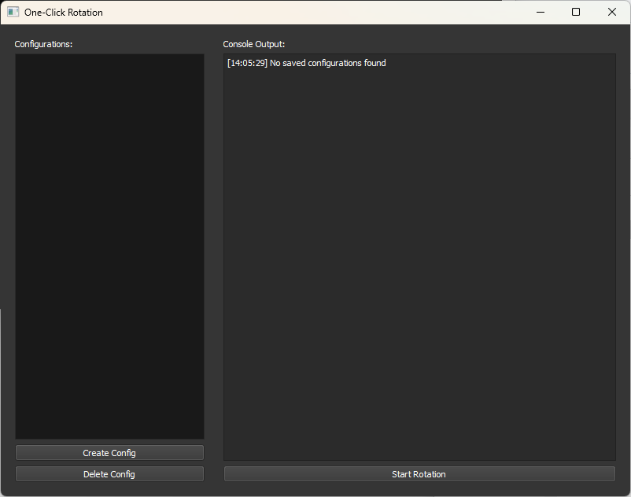
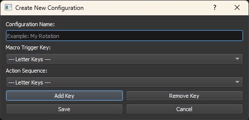

# One-Click Rotation for Gamers

## Overview

**One-Click Rotation** is a gaming tool designed for players looking to streamline their gameplay with custom key rotations. Whether you’re managing skill combos in an MMO, executing complex macros in RPGs, or automating repetitive key sequences, this tool provides a simple, effective way to enhance your gaming experience.

With an intuitive interface and full control over key configurations, you can optimize your gaming performance by executing a sequence of keypresses with a single trigger key. Stay focused on gameplay while the tool handles the heavy lifting for you!

## Features

- **Custom Key Rotations**: Create tailored keypress sequences for specific in-game actions or combos.
- **Trigger Keys**: Assign a single key to start and control your custom rotation.
- **Key Validation**: Ensures all configured keys are compatible with the tool.
- **Console Feedback**: Get real-time logs of key actions for easy debugging and monitoring during gameplay.
- **Save and Manage Configurations**: Quickly switch between setups for different games or characters.
- **Dark Gaming Theme**: The sleek interface is designed to match your gaming setup.

## Requirements

- **Platform**: Compatible with Windows.
- **Python Version**: Python 3.x.
- **Libraries**: PyQt5, keyboard.

## Installation

1. Clone the repository to your gaming PC:

   ```bash
   git clone https://github.com/username/One-Click-Rotation.git
   ```

2. Install required libraries:

   ```bash
   pip install pyqt5 keyboard
   ```

3. Launch the tool:

   ```bash
   python main.py
   ```

## How to Use

### Setting Up a Rotation

1. **Create a New Config**:
   - Click **Create Config**.
   - Enter a name (e.g., "Mage Combo").
   - Select a trigger key (e.g., `F2`) to start the macro.
   - Add keys to the action sequence (e.g., `1`, `2`, `3` for skill rotation).
   - Save your configuration.

2. **Start a Rotation**:
   - Select your configuration from the list.
   - Press **Start Rotation** to activate the macro.
   - Use the trigger key to cycle through your configured actions in-game.

3. **Stop a Rotation**:
   - Press **Stop Rotation** to halt the macro.

### Pro Tips

- Create separate configs for different characters or game scenarios.
- Use keys that won’t conflict with normal gameplay for your trigger and actions.
- Pair the tool with window-specific processes (planned feature) to make macros game-specific.

## Screenshots




## Planned Features for Gamers

- Ability to delete configurations when no longer needed.
- Support for mouse buttons as triggers or action keys for advanced gameplay setups.
- Link macros to specific games, ensuring they only run when the game is active.

## Known Bugs

- The application may temporarily freeze when stopping a macro during gameplay. Restart if needed.

## Example Use Cases

- **MMORPG**: Automate skill rotations to maximize DPS.
- **MOBA**: Quickly execute combos for heroes with complex keybinds.
- **RPG**: Chain potion usage and ability triggers for tough battles.
- **Sandbox Games**: Automate repetitive building or crafting actions.

## License

This project is licensed under the MIT License - see the [LICENSE](LICENSE) file for details.
